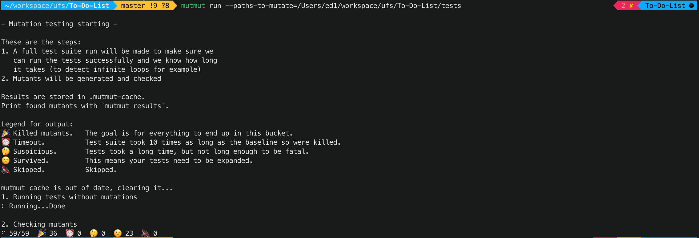
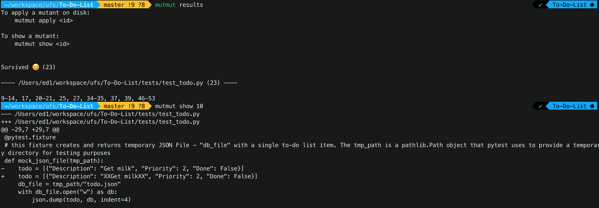
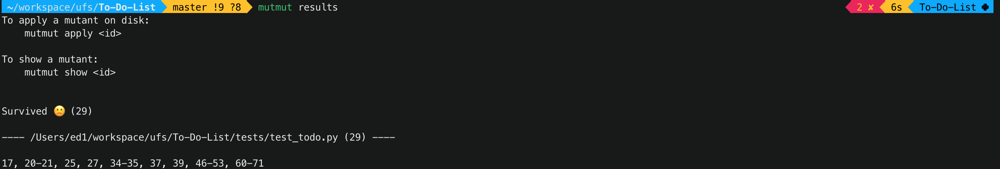

### Executando Testes de Mutação com o Mutmut em Python

**Mutação de teste** é uma técnica avançada de teste de software usada para garantir a robustez dos casos de teste. O **Mutmut** é uma ferramenta de teste de mutação para Python que ajuda a identificar pontos fracos nos testes, introduzindo alterações sutis no código-fonte (chamados de mutantes) e verificando se os testes existentes conseguem detectar essas mudanças.

#### 1. Instalação do Mutmut

Para começar, instale o Mutmut junto com as outras dependencias que estão definidas no arquivo `requirements.txt` usando o `pip`, que é o gerenciador de pacotes para Python, execute os comandos abaixo:

```bash
	sudo apt install python3-venv	
	cd cal_python
	python3 -m venv /cal_python/venv
	source venv/bin/activate
	pip install -r requirements.txt
```

Também crie um arquivo na raiz do projeto e insira as seguinte linhas: 

```bash
[mutmut]
paths_to_mutate=[SEU DIRETÓRIO]/todo/todo.py
tests_dir=[SEU DIRETÓRIO]/tests
runner=python3 -m pytest tests
```

#### 2. Preparando o Projeto para Testes de Mutação

Antes de executar os testes de mutação, você precisa garantir que o seu projeto Python está pronto para testes unitários. Certifique-se de que você tem um diretório de testes estruturado adequadamente e que seus testes estão passando. Aqui está um exemplo de estrutura de projeto:

```
[SEU PROJETO]/
│
├── todo/
│   └── todo.py
│
└── tests/
    └── test_todo.py
```

No exemplo acima, `todo.py` é o módulo que queremos testar e `test_todo.py` contém os testes unitários para o módulo.

#### 3. Executando o Mutmut

Para executar testes de mutação usando o Mutmut, siga os passos abaixo:

1. **Navegue até o diretório do seu projeto**: Certifique-se de estar no diretório raiz do seu projeto.

   ```bash
   cd TO-DO-LIST
   ```

2. **Configure o Mutmut**: Execute o comando de configuração do Mutmut para iniciar o processo de configuração dos testes de mutação.

```bash
## Tests

## Execute testes normalmente com pytest
pytest -vv  tests/todo.py 

# Gere o relatório de testes em linha
pytest -vv  tests/test_todo.py  --cov=todo

# Gere o relatório de cobertura de testes
pytest -vv  test_todo.py  --cov=todo  --cov-branch  --cov-report html

# Execute testes de mutação com mutmut
mutmut run --paths-to-mutate=[SEU DIRETÓRIO]/To-Do-List/tests
```

Esse comando vai executar os testes unitários do projeto e criar mutantes, que são pequenas mudanças no código para ver se os testes detectam a mudança. 

3. **Verifique os Resultados**: Após a execução do comando, verifique os resultados para ver quais mutantes sobreviveram e quais foram mortos.

```bash
mutmut results
```

O comando `results` fornece um resumo de quais mutantes foram detectados pelos testes e quais não foram. O objetivo é ter o maior número possível de mutantes "mortos" (detectados pelos testes).

#### 4. Analisando e Melhorando os Casos de Teste

Se alguns mutantes sobreviverem (não forem detectados pelos testes), isso significa que os testes não estão cobrindo completamente o código modificado. Nesse caso, você precisa revisar e melhorar seus casos de teste.

Para isso é necessário identifica o trecho de código que faz referência ao mutante vivo e assim alterar esse teste ou inserir um novo caso de teste para matar o mutante(testar o caso de uso detectado que não está coberto pelos testes).

#### 5. Reexecutando o Mutmut

Após adicionar o novo caso de teste, reexecute o Mutmut para verificar se o mutante aagora é detectado pelos testes:

```bash
mutmut run --paths-to-mutate=[SEU DIRETÓRIO]/To-Do-List/tests
```

Depois de executar o Mutmut novamente, verifique os resultados para garantir que todos os mutantes foram mortos:

```bash
mutmut results
```

Se todos os mutantes forem mortos, isso significa que os testes agora são robustos o suficiente para detectar a maioria das alterações no código, garantindo uma maior cobertura de teste.

#### 6. Demonstração de eliminação de mutantes no projeto

Ao executar o mutmut no projeto atual com o comando `mutmut run --paths-to-mutate=[SEU DIRETÓRIO]/To-Do-List/tests` a ferramenta nos retorna 23 mutantes vivos que precisam ser eliminados.



Agora é necessário identificar qual é esse mutante, para isso executamos o comando `mutmut results` para visualizar todos os mutante vivos, após isso executado `mutmut show 10` para ver o trecho do código referente ao mutante, conforme a image abaixo:



Portanto, no arquivo `tests/test_todo.py` inserimos mais item de teste que eliminará esse mutante.

```bash
def mock_json_file(tmp_path):
    todo = [{"Description": "Get milk", "Priority": 2, "Done": False},
            {"Description": "XXXGet milkXXX", "Priority": 2, "Done": False}] ## <- Novo item
    db_file = tmp_path/"todo.json"
    with db_file.open("w") as db:
        json.dump(todo, db, indent=4)
    return db_file
```

Agora só precisamos rodar novamente os testes e ver se o mutante foi realmente eliminado.

```bash
## Execute os testes de mutação com mutmut novamente.
mutmut run --paths-to-mutate=[SEU DIRETÓRIO]/To-Do-List/tests
```
Observe na imagem abaixo que o mutante 10 não aparece mais na lista, significando que foi eliminado.

